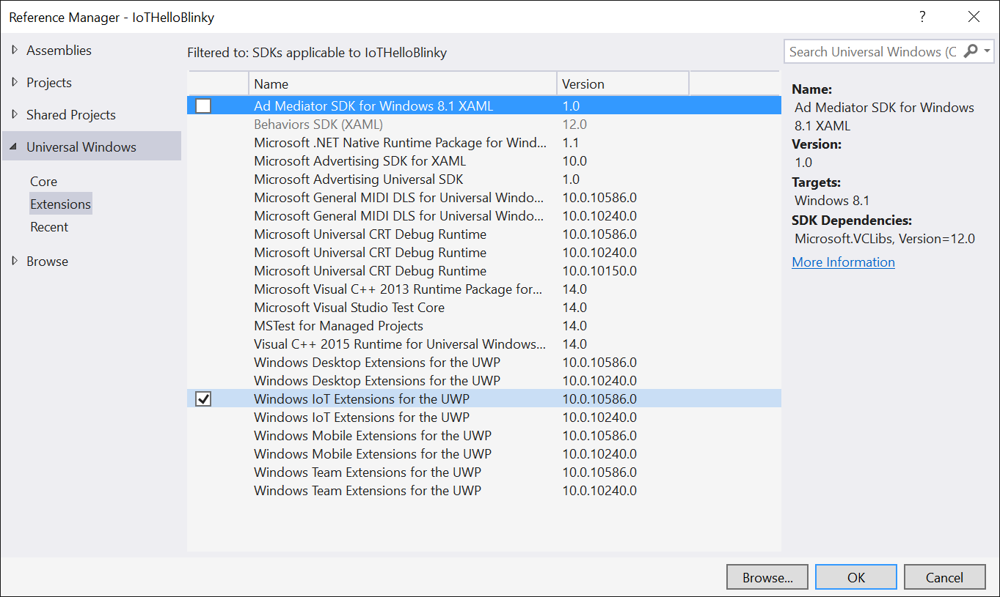

>[Home](README.md) </br>
>Previous Lab [Creating and deploying your first "Hello World" app](Device-2-HelloWorld.md)

### Exercise 3: Using Windows.Devices.Gpio ###

The **Windows.Devices.Gpio** namespace includes APIs for direct access to the IO pins on the device. Through this API, you can access digital and analog IO, I2C, SPI, and more.

The individual GPIO (General Purpose IO) pins on the Raspberry Pi may be addressed from code using the UWP GPIO APIs. We will use one of these pins to toggle an LED. You will access the GPIO pins using their logical GPIO number, not the the physical pin number. This is consistent with how other APIs and operating systems work on the Raspberry Pi.


#### Task 1 - Programming the Device IO using the GPIO Controller ####

Of course, you can hook an LED and resistor directly to one of the pins using a breadboard and jumper wires (in fact, we encourage you to try that during the Open Hack), but to keep things simple, we'll toggle the red LED on the GHI FEZ HAT that is already on your Raspberry Pi.

To do this, we'll create a new project.

1. In Visual Studio 2015, create a new **C# Blank App (Universal Windows)**. Name it anything you want. We named ours **IoTHelloBlinky**.

1. When prompted for the SDK version, set the minimum and max SDK version to 10586.

1. You'll use a ToggleButton to turn the LED on and off. In the MainPage.xaml XAML view, place the following markup inside the opening and closing Grid tags.

	````XML
    <ToggleButton x:Name="ToggleLed" Content="Toggle LED" FontSize="40"
                  Padding="15"
                  HorizontalAlignment="Center" VerticalAlignment="Center"
                  Checked="ToggleLed_Checked"
                  Unchecked="ToggleLed_Unchecked" />
    ````

1. Next, you need some code to light up the LED. However, before that, you'll need to add a reference to the IoT UWP extension library to get access to the **Windows.Devices.Gpio** namespace. As before, use the **Project - Add Reference menu** to add the extension. Be sure to check it in the dialog, not just select it. If you have more than one version listed, select the one with the highest number. In a real application, you'll want to keep this in sync with the version of Windows on the device so that you have access to all of the latest features.



1. Now that you have the extension SDK in place, you can add the code. Open the MainPage.xaml.cs code-behind file and add the following namespace to the using statements at the top of the file

	````C#
    using Windows.Devices.Gpio;
    ````

1. Next, add the code to initialize the GPIO controller and pin. The Red LED on the FEZ HAT is connected directly to GPIO 24 on the Raspberry Pi. What this code does is get the default GPIO Controller (which maps to a device driver in Windows), and opens the Red LED Pin for output. This is detailed in the [FEZ HAT schematic](http://www.ghielectronics.com/downloads/schematic/FEZ_HAT_SCH.pdf). Finally, it writes a **low** value to the pin to turn the LED off.

	````C#
    public MainPage()
    {
        this.InitializeComponent();

        InitializeGpio();
    }

    private const int LED_PIN = 24;
    private GpioPin _pin;
    private void InitializeGpio()
    {
        var controller = GpioController.GetDefault();

        if (controller != null)
        {
            _pin = controller.OpenPin(LED_PIN);

            _pin.SetDriveMode(GpioPinDriveMode.Output);

            _pin.Write(GpioPinValue.Low);
        }
        else
        {
            System.Diagnostics.Debug.WriteLine("Target device has no GPIO controller");
        }
    }
    ````

1. At this point, we have the pin opened and set to the right mode. The final step is to actually toggle the pin's state when the toggle button is pressed. Add the following event handler code to the same code-behind file.

	````C#
    private void ToggleLed_Checked(object sender, RoutedEventArgs e)
    {
        if (_pin != null)
            _pin.Write(GpioPinValue.High);
    }

    private void ToggleLed_Unchecked(object sender, RoutedEventArgs e)
    {
        if (_pin != null)
            _pin.Write(GpioPinValue.Low);
    }
    ````

1. The code is complete. Now follow the same deployment steps you used in the previous exercise to deploy the app to the Raspberry Pi. (First, set the target to **ARM**, then select the **Remote Machine**).

1. Again from the "Windows IoT Remote Client" and using the mouse, click the button on and off and look at the red LED on the board. If you want to see the debugging in action, place a breakpoint in both of the event handlers and step through when you click the button.

>[Home](README.md) </br>
>Next Lab [Programming IO](Device-4-Programming-IO.md)
