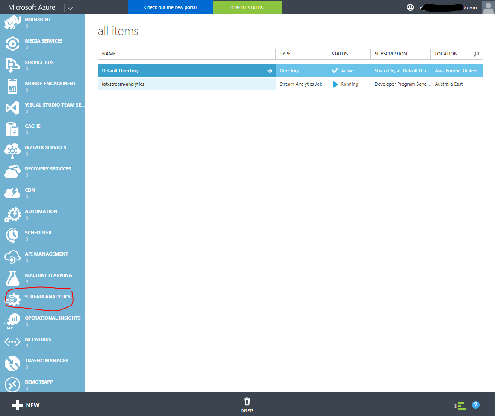

>[Home](README.md) </br>
>Previous Lab [Streaming Telemetry from a device](Device-2-Streaming.md)

# Consuming the IoT Hub data

You have seen how to use the Device Explorer to peek the data being sent to the Azure IoT Hub. 
However, the Azure IoT suite offers many different ways to generate meaningful information from the data gathered by the devices. 
In the following section you will use Azure Stream Analytics in combination with Microsoft Power BI to consume the data and to generate meaningful reports.


## Analytics with Power BI

One of the most interesting ways to use the information received from the connected device/s is to get near real-time analysis using the **Microsoft Power BI** tool. In this section you will see how to configure this tool to get an online dashboard showing summarized information about the different sensors.


### Task 1 - Setting up a Power BI account

If you don't have a Power BI account already, you will need to create one (a free account is enough to complete this lab). If you already have an account set you can skip this step.


1. Go to the [Power BI website](https://powerbi.microsoft.com/) and follow the sign-up process.

	**Note:** At the moment this lab was written, only users with corporate email accounts are allowed to sign up. Free consumer email accounts (like Outlook, Hotmail, Gmail, Yahoo, etc.) can't be used.

2. You will be asked to enter your email address. Then a confirmation email will be sent. After following the confirmation link, a form to enter your personal information will be displayed. Complete the form and click Start.

	The preparation of your account will take several minutes, and when it's ready you will see a screen similar to the following:

	

	_Power BI welcome screen_

Now that your account is set, you are ready to set up the data source that will feed the Power BI dashboard.


### Task 2 - Create a Service Bus Consumer Group

In order to allow several consumer applications to read data from the IoT Hub independently at their own pace a Consumer Group must be configured for each one. If all of the consumer applications (the Device Explorer, Stream Analytics / Power BI, the Web site you will configure in the next section) read the data from the default consumer group, one application will block the others.

To create a new Consumer Group for the IoT Hub that will be used by the Stream Analytics job you are about to configure, follow these steps:

- Open the Azure Portal (https://portal.azure.com/), and select the IoT Hub you created.
- From the settings blade, click on **Messaging**
- At the bottom of the Messaging blade, type the name of the new Consumer Group "PowerBI"
- From the top menu, click on the Save icon


### Task 3 - Setting the data source

In order to feed the Power BI reports with the information gathered by the hats and to get that information in near real-time, **Power BI** supports **Azure Stream Analytics** outputs as data source. 
The following section will show how to configure the Stream Analytics job created in the Setup section to take the input from the IoT Hub and push that summarized information to Power BI.


### Task 4 - Stream Analytics Input Setup

Before the information can be delivered to **Power BI**, it must be processed by a **Stream Analytics Job**. To do so, an input for that job must be provided. As the Raspberry devices are sending information to an IoT Hub, it will be set as the input for the job.

1. Go to the classic [Azure management portal](Stream Analytics Input ) (https://manage.windowsazure.com) and select the **Stream Analytics** service. 

 


	1. Click "Create a new Stream Analytics job" if this is your first job, or click the plus sign to add an additional job.
	2. Complete the form
		- JOB NAME: iot-stream-analytics or something similar
		- REGION: Suggest selecting the region closest to your IoT Hub
		- REGIONAL MONITORING STORAGE ACCOUNT: Likely "Create new storage account
		- NEW STORAGE ACCOUNT NAME: Needs to be a globally unique name. Your app or alias name followed by the word storage eg gloveboxstorage
	3. Click "CREATE STREAM ANALYTICS JOB
	
2. Once the Stream Analytics job is created click on it to configure.

2. As you can see, the Start button is disabled since the job is not configured yet. To set the job input click on the **INPUTS** tab and then in the **Add an input** button.

3. In the **Add an input to your job** popup, select the **Data Stream** option and click **Next**. In the following step, select the option **IoT Hub** and click **Next**. Lastly, in the **IoT Hub Settings** screen, provide the following information:

	- **Input Alias:** _TelemetryHub_
	- **Subscription:** Use IoT Hub from Current Subscription (you can use an Event Hub from another subscription too by selecting the other option)
	- **Choose an IoT Hub:** _iot-sample_ (or the name used during the IoT Hub creation)
	- **IoT Hub Shared Access Policy Name:** _iothubowner_
	- **IoT Hub Consumer Group:** _powerbi_

	

	_Stream Analytics Input Configuration_

4. Click **Next**, and then **Complete** (leave the Serialization settings as they are).


### Task 5 - Stream Analytics Output Setup

The output of the Stream Analytics job will be Power BI.

1. To set up the output, go to the Stream Analytics Job's **OUTPUTS** tab, and click the **ADD AN OUTPUT** link.

2. In the **Add an output to your job** popup, select the **POWER BI** option and the click the **Next button**.

3. In the following screen you will setup the credentials of your Power BI account in order to allow the job to connect and send data to it. Click the **Authorize Now** link.

	

	_Stream Analytics Output Configuration_

	You will be redirected to the Microsoft login page.

4. Enter your Power BI account email and password and click **Continue**. If the authorization is successful, you will be redirected back to the **Microsoft Power BI Settings** screen.

5. In this screen you will enter the following information:

	- **Output Alias**: _PowerBI_
	- **Dataset Name**: _Raspberry_
	- **Table Name**: _Telemetry_
	- **Group Name**: _My Workspace_

	

	_Power BI Settings_

6. Click the checkmark button to create the output.


### Task 6 - Stream Analytics Query configuration

Now that the job's inputs and outputs are already configured, the Stream Analytics Job needs to know how to transform the input data into the output data source. To do so, you will create a new Query.

1. Go to the Stream Analytics Job **QUERY** tab and replace the query with the following statement:

	````SQL
	SELECT
		iothub.connectiondeviceid displayname,
		location,
		guid,
		measurename,
		unitofmeasure,
		Max(DateAdd(Hour, 10, EventEnqueuedUtcTime)) AS TimeCreated, -- AU EST UTC + 10
		Avg(value) AvgValue
	INTO
		[PowerBI]
	FROM
		[TelemetryHUB] TIMESTAMP BY EventEnqueuedUtcTime
	GROUP BY
		iothub.connectiondeviceid, location, guid, measurename, unitofmeasure,
		TumblingWindow(Second, 30)
	````

	The query takes the data from the input (using the alias defined when the input was created **TelemetryHUB**) and inserts into the output (**PowerBI**, the alias of the output) after grouping it using 10 seconds chunks.

2. Click on the **SAVE** button and **YES** in the confirmation dialog.


### Task 7 - Starting the Stream Analytics Job

Now that the job is configured, the **START** button is enabled. Click the button to start the job and then select the **JOB START TIME** option in the **START OUTPUT** popup. After clicking **OK** the job will be started.

Once the job starts it creates the Power BI datasource associated with the given subscription.

**NOTE: Starting a Stream Analytics job will start to consume your Azure Credits.**


### Task 8 - Setting up the Power BI dashboard

1. Now that the datasource is created, go back to your Power BI session, and go to **My Workspace** by clicking the **Power BI** link.

	After some minutes of the job running you will see that the dataset that you configured as an output for the Job, is now displayed in the Power BI workspace Datasets section.

	

	_Power BI: New Datasource_

	> **Note:** The Power BI dataset will only be created if the job is running and if it is receiving data from the IoT Hub input, so check that the Universal App is running and sending data to Azure to ensure that the dataset be created. To check if the Stream Analytics job is receiving and processing data you can check the Azure management Stream Analytics monitor.

2. Once the datasource becomes available you can start creating reports. To create a new Report click on the **Raspberry** datasource:

	

	_Power BI: Report Designer_

	The Report designer will be opened showing the list of fields available for the selected datasource and the different visualizations supported by the tool.

3. To create the _Average Light by time_ report, select the following fields:

	- avgvalue
	- timecreated

	As you can see the **avgvalue** field is automatically set to the **Value** field and the **timecreated** is inserted as an axis. Now change the chart type to a **Line Chart**:

	

	_Selecting the Line Chart_

4. Then you will set a filter to show only the Light sensor data. To do so drag the **measurename** field to the **Filters** section and then select the **Light** value:

	
	

	_Selecting the Report Filters_

5. Now the report is almost ready. Click the **SAVE** button and set _Light by Time_ as the name for the report.

	

	_Light by Time Report_

6. Now you will create a new Dashboard, and pin this report to it. Click the plus sign (+) next to the **Dashboards** section to create a new dashboard. Set _Raspberry Telemetry_ as the **Title** and press Enter. Now, go back to your report and click the pin icon to add the report to the recently created dashboard.

	

	_Pinning a Report to the Dashboard_

1. To create a second chart with the information of the average Temperature follow these steps:
	1. Click on the **Raspberry** datasource to create a new report.
	2. Select the **avgvalue** field
	3. Drag the **measurename** field to the filters section and select **Temperature**
	4. Now change the visualization to a **gauge** chart:

		

		_Gauge visualization_

	5. Change the **Value** from **Sum** to **Average**

		

		_Change Value to Average_

		Now the Report is ready:

		

		_Gauge Report_

	6. Save and then Pin it to the Dashboard.

7. Following the same directions, create a _Temperature_ report and add it to the dashboard.
8. Lastly, edit the reports name in the dashboard by clicking the pencil icon next to each report.

	

	_Editing the Report Title_

	After renaming both reports you will get a dashboard similar to the one in the following screenshot, which will be automatically refreshed as new data arrives.

	

	_Final Power BI Dashboard_
	
	
9. Try the Power Bi app available in the iOS App store, Google Play and Windows Store.

>[Home](README.md) </br>
>Next Lab [Controlling a device from IoT Hub](Device-3-CommandControl.md)