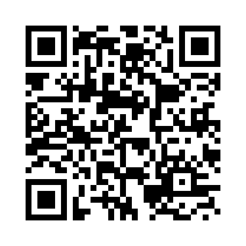

<a name="HOLTop"></a>
# Introduction to Azure IoT with Windows 10 IoT Core (Raspberry Pi 3) #

---

<a name="Overview"></a>
## Overview ##

**Azure IoT Hub** is an Azure service that enables secure and reliable bi-directional communications between your application back end and millions of devices. It allows the application back end to receive telemetry at scale from your devices, route that data to a stream event processor, and also to send cloud-to-device commands to specific devices.

**Windows 10 IoT Core** is a version of **Windows 10** that is optimized for smaller devices with or without a display, and that runs on the **Raspberry Pi, Arrow DragonBoard & MinnowBoard MAX**. **Windows 10 IoT Core** utilizes the rich, extensible [Universal Windows Platform (UWP)](https://msdn.microsoft.com/library/windows/apps/dn726767.aspx) API for building great solutions.

In this module you will use a Raspberry Pi device with [Windows 10 Iot Core](http://ms-iot.github.io/content/en-US/Downloads.htm) and a [FEZ HAT](https://www.ghielectronics.com/catalog/product/500) sensor hat. Using a Windows 10 Universal Application, the sensors get the raw data and format it into a JSON string. That string is then shuttled off to the [Azure IoT Hub](https://azure.microsoft.com/en-us/services/iot-hub/), where it gathers the data and is then displayed in an Azure website. Finally, you'll see how to send cloud-to-device messages to your device to command it.


<a name="Objectives"></a>
### Objectives ###
In this module, you'll see how to:

- Create a Universal app that reads sensor information from a Raspberry Pi running Windows 10 IoT Core
- Upload those readings to an Azure IoT Hub
- Display the the IoT Hub information in a website
- Command your device based on IoT Hub Cloud-To-Device messages


<a name="Prerequisites"></a>
### Prerequisites ###

The following is required to complete this module:

- Attended the [Intro to Windows 10 IoT Core](../Module1-IntroWindows10IoTCore) module, or have used Windows 10 IoT Core previously.
- Windows 10 with [developer mode enabled][1]
- [Visual Studio Community 2015][2] with [Update 1][3] or greater
- [IoT Core Dashboard and Tools][4]
- [Azure Device Explorer][7].
-  ** [Direct Link for Device Explorer](https://github.com/Azure/azure-iot-sdks/releases/download/2016-03-28/SetupDeviceExplorer.msi) **
- [Raspberry Pi board with Windows IoT Core image][5]
- [GHI FEZ HAT][6]

[1]: https://msdn.microsoft.com/library/windows/apps/xaml/dn706236.aspx
[2]: https://www.visualstudio.com/products/visual-studio-community-vs
[3]: http://go.microsoft.com/fwlink/?LinkID=691134
[4]: http://ms-iot.github.io/content/en-US/GetStarted.htm
[5]: https://ms-iot.github.io/content/en-US/win10/RPI.htm
[6]: https://www.ghielectronics.com/catalog/product/500
[7]: https://github.com/Azure/azure-iot-sdks/blob/master/tools/DeviceExplorer/doc/how_to_use_device_explorer.md

> **Note:** The PCs at Build 2016 are pre-provisioned with all required software. You can take advantage of the [Visual Studio Dev Essentials]( https://www.visualstudio.com/en-us/products/visual-studio-dev-essentials-vs.aspx) subscription in order to get everything you need to build and deploy your app on any platform.

All of the GitHub files for this lab are available locally in c:\CodeLabs-IoTDev . Be sure to log out at the end of the session so the files can be reset from GitHub.

<a name="Exercises"></a>
## Exercises ##
This module includes the following exercises:

1. [Connecting and configuring your device](#Exercise1)
1. [Sending telemetry data to Azure IoT Hub](#Exercise2)
1. [Consuming the IoT Hub data from a Website](#Exercise3)
1. [Sending commands to your devices](#Exercise4)

Estimated time to complete this module: **60 minutes**

>**Note:** When you first start Visual Studio, you must select one of the predefined settings collections. Each predefined collection is designed to match a particular development style and determines window layouts, editor behavior, IntelliSense code snippets, and dialog box options. The procedures in this module describe the actions necessary to accomplish a given task in Visual Studio when using the **General Development Settings** collection. If you choose a different settings collection for your development environment, there may be differences in the steps that you should take into account.

<a name="Exercise1"></a>
### Exercise 1: Connecting and configuring your device ###

In this exercise, you'll verify the setup of your Raspberry Pi and set up the GHI FEZ HAT devices.

<a name="Ex1Task1"></a>
#### Task 1 - Setting up your Device and Verifying the Connection ####

In this task, you'll setup your devices by following these steps:

1. Plug the **GHI FEZ HAT** into the **Raspberry Pi**.

	

	_The FEZ hat connected to the Raspberry Pi device_


	

	_Windows 10 IoT Core with FEZ hat hardware setup_

1. Launch the _Device Portal_ by browsing the **Wired Ethernet** _IP address_ of the Raspberry Pi and adding **:8080**.

1. In the credentials dialog, use the default username and password. Username: _Administrator_ Password: _p@ssw0rd_

	

	_Device Portal credentials_

1. You will see the web management (WebB) home screen.

	

	_Windows Device Portal_

1. Click **Networking** in the left-hand pane.

	

	_Networking page_

1. On the networking screen, verify that IoT-Lab is the selected (checked) network profile. This network has been specifically configured to allow through the AMQP/AMQPS traffic required for communicating to Azure.

<a name="Exercise2"></a>
### Exercise 2: Sending telemetry data to Azure IoT Hub ###

In this exercise, you'll create an Azure IoT Hub to provide reliable and secure bi-directional communications between your IoT device and a Universal app.

<a name="Ex2Task1"></a>
#### Task 1 - Creating an IoT Hub ####
In this task, you'll create an IoT Hub for communicating with your device.

1. Go to the Azure portal, by navigating to http://portal.azure.com

1. Create a new IoT Hub. To do this, click **New** in the jumpbar, then click **Internet of Things**, then click **Azure IoT Hub**.

1. Configure the **IoT hub** with the desired information:

 - Enter a **Name** for the hub e.g. _iot-workshop_ (note that this should be a globally unique name of your own choosing),
 - Select a **Pricing and scale tier** (_F1 Free_ tier is enough),
 - Create a new resource group, or select and existing one. For more information, see [Using resource groups to manage your Azure resources](https://azure.microsoft.com/en-us/documentation/articles/resource-group-portal/).
 - Select the **Region** _West US_ for where the service will be located.

	

	_New IoT Hub Settings_

1. It can take a few minutes for the IoT hub to be created. Once it's ready, open the blade of the new IoT hub, take note of the **hostname**. Select the key icon at the top to access the shared access policy settings:

	

	_IoT hub shared access policies_

1. Select the Shared access policy called **iothubowner**, and take note of the **Primary key** and **connection string** in the right blade.  You should copy these into a text file since you'll need them later.

	

	_Get IoT Hub owner connection string_

<a name="Ex2Task2"></a>
#### Task 2 - Registering your device ####

You must register your device in order to be able to send and receive information from the Azure IoT Hub. This is done by registering a [Device Identity](https://azure.microsoft.com/en-us/documentation/articles/iot-hub-devguide/#device-identity-registry) in the IoT Hub.

1. Open the **Device Explorer** app (C:\Program Files (x86)\Microsoft\DeviceExplorer\DeviceExplorer.exe), and fill the **IoT Hub Connection String** field with the connection string of the IoT Hub you created in a previous step, and click **Update**.

	

	_Configure Device Explorer_

1. Go to the **Management** tab and click **Create**. The Create Device popup will be displayed. Fill the **Device ID** field with a new Id for your device (_myRaspberryDevice_ for example) and click **Create**:

	

	_Creating a Device Identity_

1. Once the device identity is created, it will be displayed on the grid. Right click the identity you just created, select **Copy connection string for selected device** and take note of the value copied to your clipboard, since it will be required to connect your device with the IoT Hub.

	

	_Copying Device connection information_

	> **Note:** The device identities registration can be automated using the Azure IoT Hubs SDK. An example of how to do that can be found [here](https://azure.microsoft.com/en-us/documentation/articles/iot-hub-csharp-csharp-getstarted/#create-a-device-identity).

<a name="Ex2Task3"></a>
#### Task 3 - Sending telemetry data to the Azure IoT hub ####

Now that the device is configured, you'll see how to make an application read the values of the FEZ HAT sensors, and then send those values to an Azure IoT Hub.

This task uses an existing Universal application that will be deployed to your Raspberry Pi device and use FEZ HAT sensors.

1. Open in Visual Studio the **IoTWorkshop.sln** solution located at **Source\Ex2\Begin** folder.

1. In **Solution Explorer**, right-click the **IoTWorkshop** project, and then click **Manage NuGet Packages**.

1. In the **NuGet Package Manager** window, click **Browse** and search for **Microsoft Azure Devices** and **PCL Crypto**, click **Install** to install the **Microsoft.Azure.Devices.Client** and **PCLCrypto** packages, and accept the terms of use.

    This downloads, installs, and adds a reference to the [Microsoft Azure IoT Service](https://www.nuget.org/packages/Microsoft.Azure.Devices/) SDK NuGet package.

1. Add the following _using_ statements at the top of the **MainPage.xaml.cs** file:

	````C#
	using Microsoft.Azure.Devices.Client;
	````

1. Add the following field to the **MainPage** class, replace the placeholder value with the **device connection string** you've created in the previous task (note that the curly braces { } are _NOT_ part of the connection string and should be _removed_ when you paste in your connection string):

	````C#
	private DeviceClient deviceClient = DeviceClient.CreateFromConnectionString("{device connection string}");
	````

1. Add the following method to the **MainPage** class to create and send messages to the IoT hub. Resolve the missing using statements.

	````C#
	public async void SendMessage(string message)
	{
		 // Send message to an IoT Hub using IoT Hub SDK
		 try
		 {
			  var content = new Message(Encoding.UTF8.GetBytes(message));
			  await deviceClient.SendEventAsync(content);

			  Debug.WriteLine("Message Sent: {0}", message, null);
		 }
		 catch (Exception e)
		 {
			  Debug.WriteLine("Exception when sending message:" + e.Message);
		 }
	}
	````

1. Add the following code to the **Timer_Tick** method to send a message with the temperature and another with the light level:

	````C#
	// send data to IoT Hub
	var jsonMessage = string.Format("{{ displayname:null, location:\"USA\", organization:\"Fabrikam\", guid: \"41c2e437-6c3d-48d0-8e12-81eab2aa5013\", timecreated: \"{0}\", measurename: \"Temperature\", unitofmeasure: \"C\", value:{1}}}",
		 DateTime.UtcNow.ToString("o"),
		 temp);

	this.SendMessage(jsonMessage);

	jsonMessage = string.Format("{{ displayname:null, location:\"USA\", organization:\"Fabrikam\", guid: \"41c2e437-6c3d-48d0-8e12-81eab2aa5013\", timecreated: \"{0}\", measurename: \"Light\", unitofmeasure: \"L\", value:{1}}}",
		 DateTime.UtcNow.ToString("o"),
		 light);

	this.SendMessage(jsonMessage);
	````

	1. In order to deploy your app to the IoT device, select the **ARM** architecture in the Solution Platforms dropdown.

		

		_ARM Solution Platform_

	1. Next, click the **Device** dropdown and select **Remote Machine**.

		

		_Run in remote machine_

	1. In  the **Remote Connections** dialog, click your device name within the **Auto Detected** list and then click **Select**. Not all devices can be auto detected, if you don't see it, enter the IP address using the **Manual Configuration**. After entering the device name/IP, select **Universal (Unencrypted Protocol)** Authentication Mode, then click **Select**.

		

		_Remote Connections dialog_

1. Press **F5** to run and deploy the app to the device.

	The information being sent can be monitored using the Device Explorer application. Run the application and go to the **Data** tab and select the name of the device you want to monitor (_myRaspberryDevice_ in your case), then click  **Monitor**.

	

	_Monitoring messages sent_

    **Note**: If you navigate back to your IoT Hub blade in the Azure Portal, it may take a couple minutes before the message count is updated to reflect the device activity under **Usage**.

<a name="Exercise3"></a>
### Exercise 3: Consuming the IoT Hub data from a Website ###

In this exercise, you'll deploy a website to Azure, and then you'll enable WebSockets to allow communication with the IoT hub, and display live telemetry data using charts.

<a name="Ex3Task1"></a>
#### Task 1 - Create a Consumer Group for the Web site ####
In order to allow several consumer applications to read data from the IoT Hub independently, a **Consumer Group** must be configured for each one. If all of the consumer applications (the Device Explorer, Stream Analytics / Power BI, the Web site you'll configure in the next section) read the data from the default consumer group, only one application will retain the lease and the others will be disconnected.

In this task you'll create two Consumer Groups for the website to avoid conflicts with other consumers.

> **Important Note:** In order to use the EventProcessorHost class, for Build 2016, you must create an Azure Storage account to enable the EventProcessorHost to record checkpoint information. **Please follow the instructions in [About Azure Storage](https://azure.microsoft.com/en-us/documentation/articles/storage-create-storage-account/#create-a-storage-account) to create a new one. Make a note of the storage account connection string because you'll need it later.**

1. Open the Azure Portal (https://portal.azure.com/), and select the IoT Hub you created.

1. From the settings blade, click **Messaging**.

1. At the bottom of the **Messaging** blade, type the name of each new **Consumer Group** and then **Save**:
  - _website_
  - _local_ (used when debugging)

1. Take note of the **Event Hub-compatible name** and **Event Hub-compatible endpoint** values in the _Messaging_ blade

	

	_Adding website consumer groups_

1. Go to the **Source\Ex3\Begin** folder, and open the Web Site project (_IoTWorkshopWebSite.sln_) in Visual Studio.

1. Edit the _Web.config_ file and add the corresponding values for the following keys:
	- **Microsoft.ServiceBus.EventHubDevices**: Event hub-compatible name you copied in the previous step.
	- **Microsoft.ServiceBus.ConnectionStringDevices**: Event hub-compatible connection string which is composed by the **Event hub-compatible endpoint** and the **_iothubowner_ Shared access policy Primary Key**.
	- **Microsoft.Storage.ConnectionString**: insert the **storage account name** and **storage account primary key** corresponding to your Storage Account to complete the endpoint.

1. Did you create the storage account? :)

<a name="Ex3Task2"></a>
#### Task 2 - Deploying to Azure Web Site ####

In this task, you'll deploy the website to an Azure Web Site.

1. In Visual Studio, right-click the project name and select **Publish**.

1. Select **Microsoft Azure App Service**. **(Note that the name has been changed to Web App. Please select that.)**

	

	_Selecting Publish target_

1. Click **New** and use the following configuration.

	- **Web App name**: Pick something unique, e.g. _iotmodule_.
	- **App Service plan**: Select an App Service plan in the same region used for the _IoT Hub_ or create a new one using that region.
	- **Region**: Pick same region as you used for the _IoT Hub_.
	- **Database server**: No database.

1. Click **Create**. After some time the website will be created in Azure.

	

	_Creating a new Web App on Microsoft Azure_

1. Click **Publish**.

	> **Note:** You might need to install the **WebDeploy** extension if you are having an error stating that the Web deployment task failed. You can find WebDeploy [here](http://www.iis.net/downloads/microsoft/web-deploy).


<a name="Ex3Task3"></a>
#### Task 3 - Enabling WebSockets in the Azure Web Site ####
After you deploy the site, it's required that you enable **Web sockets**. To do this, perform the following steps:

1. Browse to https://portal.azure.com and select your _iotmodule_ Web app.

1. Click **Settings**.

1. Click **Applicattion settings**

1. Then set **Web sockets** to **On** and click **Save**.

	

	_Enabling Web Sockets in your website_


1. Navigate to your recently deployed Web Application. You will see something like in the following screenshot. There will be 2 real-time graphs representing the values read from the temperature and light sensors.

	> **Note:** Take into account that the Universal app must be running and sending information to the IoT Hub in order to see the graphics.

	

	_Web Site Consuming the IoT Hub data_

	> **Note:** At the bottom of the page you should see "**Connected**". If you see "**ERROR undefined**" you likely didn't enabled **WebSockets** for the Azure Web Site.


<a name="Exercise4"></a>
### Exercise 4: Sending commands to your devices ###

Azure IoT Hub is a service that enables reliable and secure bi-directional communications between millions of IoT devices and an application back end. In this section you will see how to send cloud-to-device messages to your device to command it to change the color of one of the FEZ HAT leds, using the Device Explorer app as the back end.

In this exercise, you'll add the logic to process the messages received from your Raspberry Pi.

<a name="Ex4Task1"></a>
#### Task 1 - Processing IoT Hub received messages ####

In this task, you'll add logic to process the messages received from the IoT Hub.

1. Open the Universal app you created before and add the following method to the **MainPage.xaml.cs** file. The _ReceiveAsync_ method returns the received message at the time that it is received by the device. The call to _CompleteAsync()_ notifies IoT Hub that the message has been successfully processed and that it can be safely removed from the device queue. If something happened that prevented the device app from completing the processing of the message, IoT Hub will deliver it again.

	````C#
	public async Task<string> ReceiveMessage()
	{
		try
		{
			var receivedMessage = await this.deviceClient.ReceiveAsync();

			if (receivedMessage != null)
			{
				var messageData = Encoding.ASCII.GetString(receivedMessage.GetBytes());
				this.deviceClient.CompleteAsync(receivedMessage);
				return messageData;
			}
			else
			{
				return string.Empty;
			}
		}
		catch (Exception e)
		{
			Debug.WriteLine("Exception when receiving message:" + e.Message);
			return string.Empty;
		}
	}
	````

1. Now you will add the logic to process the messages received, add a new timer to the _MainPage_ class:

	````C#
	private DispatcherTimer commandsTimer;
	````

1. Add the following method, which will be in charge of processing the commands. 	It reads the message received, and according to the text of the command, it set the value of the _hat.D2.Color_ attribute to change the color of the FEZ HAT's LED D2. When the "OFF" command is received the _TurnOff()_ method is called, which turns the LED off.

	````C#
	private async void CommandsTimer_Tick(object sender, object e)
	{
		string message = await ReceiveMessage();

		if (message != string.Empty)
		{
			System.Diagnostics.Debug.WriteLine("Command Received: {0}", message);
			switch (message.ToUpperInvariant())
			{
				case "RED":
					hat.D2.Color = new FEZHAT.Color(255, 0, 0);
					break;
				case "GREEN":
					hat.D2.Color = new FEZHAT.Color(0, 255, 0);
					break;
				case "BLUE":
					hat.D2.Color = new FEZHAT.Color(0, 0, 255);
					break;
				case "OFF":
					hat.D2.TurnOff();
					break;
				default:
					System.Diagnostics.Debug.WriteLine("Unrecognized command: {0}", message);
					break;
			}
		}
	}
	````

1. Lastly, add the following piece of code to the _SetupHat_ method in order to initialize the timer used to poll for messages.

	````C#
	//setup receive timer
	this.commandsTimer = new DispatcherTimer();
	this.commandsTimer.Interval = TimeSpan.FromSeconds(60);
	this.commandsTimer.Tick += this.CommandsTimer_Tick;
	this.commandsTimer.Start();
	````

	> **Note:** The recommended interval for HTTP/1 message polling is 25 minutes. For debugging and demonstration purposes a 1 minute polling interval is fine (you can use an even smaller interval for testing), but bear it in mind for production development. Check this [article](https://azure.microsoft.com/en-us/documentation/articles/iot-hub-devguide/) for guidance. When AMQP becomes available for the IoT Hub SDK using UWP apps a different approach can be taken for message processing, since AMQP supports server push when receiving cloud-to-device messages, and it enables immediate pushes of messages from IoT Hub to the device. The following [article](https://azure.microsoft.com/en-us/documentation/articles/iot-hub-csharp-csharp-c2d/) explains how to handle cloud-to-device messages using AMQP.

<a name="Ex4Task2"></a>
#### Task 2 - Processing IoT Hub received messages ####

1. Deploy the app to the device and open the **Device Explorer** app.

1. Once it's loaded (and configured to point to your IoT hub), go to the **Messages To Device** tab, check the **Monitor Feedback Endpoint** option and write your command, e.g. BLUE, in the **Message** field. Click **Send**.

	

	_Sending cloud-to-device message_

1. After a few seconds the message will be processed by the device and the LED will turn on in the color you selected. The feedback will also be reflected in the Device Explorer screen after a few seconds.

	

	_Cloud-to-device message received_

---

<a name="Summary"></a>
## Summary ##

By completing this module, you should have:

- Learned how to connect and configure a **Raspberry Pi** device with **Windows 10 IoT Core**.
- Learned how to create an Azure IoT hub and configure a device app to connect to the hub.
- Created a **Windows Universal Platform** app and deployed to a remote Windows IoT device that sends telemetry messages to Azure IoT Hub.
- Programmed the input (buttons) and output (LEDs) of a GHI's FEZ HAT topping connected to the Raspberry Pi.
- Read the temperature and light sensors and set the RGB LEDs colors from the FEZ HAT.
- Configured and deployed an **Azure Web site** that consumes and displays the live data from the **Azure IoT Hub**.
- Sent commands to your IoT devices from **Azure IoT Hub**.


Build attendees, please submit a quick evaluation for this lab:


