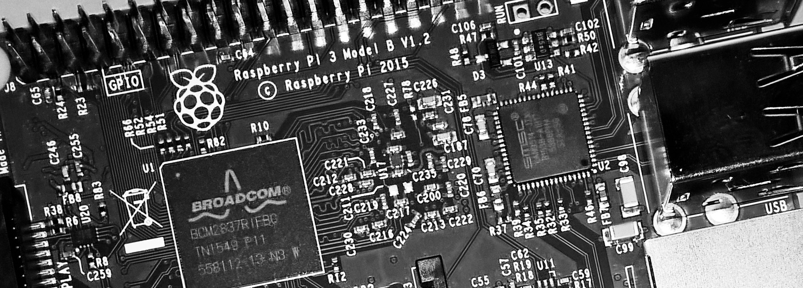

<a name="HOLTop" />

# IoT/Embedded Open Hack #

In the live Code Labs at Build 2016, we have included a number of additional devices which may be used for "open hack / open play / free play" to experiment with Windows, IoT Core, Arduino, and more. The intent here is to let you use devices you may not have had past experience with, and then take your code and further develop it when you return home. Please use the time here to experiment with the devices we have, and the services we'd provided access to. You'll find Windows, Azure, Arduino, and more all available for you to build with.

We hope to see your examples up on our samples site at http://microsoft.hackster.io !

---

## Guidelines for Devices / Azure IoT Open Hack

We want the Open Hack to be as open and rewarding as possible. In order to support both the hack and the structured labs and create a great experience for everyone over the duration of Build, we have some guidelines that we ask you to follow while participating.

The Open Hack is available on days 2 and 3 of Build 2016. Please attend sessions and/or the structured labs on Day 1. The room is not open during the keynotes.

Before participating in the Open Hack at Build, please attend the introduction to Windows 10 IoT and/or the introduction to Azure IoT. 
Please do not remove any of the tools, materials, devices, sensors, wires, components, SD cards, etc. from the room. Please ask a proctor if there are any questions.

"Take only pictures. Leave only footprints."

Please do not format or change the operating system on the Raspberry Pi. Please use the operating system that is already installed. If you run into issues due to a corrupt SD card or OS image, please see an in-room proctor. **Please do not remove the SD card.**

**Please do not remove the Raspberry Pi itself from its mounting base.**

Try not to short 5v or 3v3 to ground and let out the magic smoke. :) (If you do, please let us know so the next person at that station doesn't have a broken experience.) If you are unfamiliar with electronics, we suggest you start with either the FEZ HAT or the Gadgeteer approaches in the open play.

If you create something you want to save, please use a web email or dropbox/onedrive/etc. client to get the source code to your personal account. All projects may be removed from machines in between sessions.

At the end of the session, please return everything (except the Pi and the FEZ HAT) to the designated equipment staging location in the room so that the next attendee will have a clean workstation to begin with.

**You may stay in the room and work on your project for multiple consecutive sessions, space permitting. If seating is tight, priority will be given to those participating in modules 1, 2, and 3 and you may be asked to come back at another time. If you are staying through more than one session, please let a proctor know at the end of the session so we do not reset that machine.**

Need inspiration? Check out our hackster.io site: https://microsoft.hackster.io/en-US

**Take photos! Blog/tweet/instagram your experience and your creations. Show us what you made!**

<a href="#HOLTop"> -- Back to Top -- </a>

## Important instructions for removing the FEZ HAT or Adafruit HAT
If your exploration requires removing any HAT from the Pi, please **carefully** remove the HAT from the Raspberry Pi. Be careful to lift it straight off using a gentle rocking motion, so as not to bend the pins on the Raspberry Pi. Do not lift off the HAT in the way you might lift up a post-it note, as it will bend the pins and possibly break them. If you are unsure as to how to do this, please see one of the in-room proctors for assistance.

Set the FEZ HAT down at your workstation so that it is available for other lab participants.

<a href="#HOLTop"> -- Back to Top -- </a>

## Key links
There are links to resources in each of the sections in this doc. However, here are the most important general resources for both devices and Microsoft Azure.

Device resources

  * [Windows on Devices Dev Center](http://windowsondevices.com)
  * [Windows 10 IoT Core Docs and Samples](http://ms-iot.github.io/content/en-US/win10/StartCoding.htm)
  * [Arduino Wiring Reference](http://www.arduino.cc/en/Reference/HomePage)
  * [Windows 10 UWP Official Samples](http://github.com/Microsoft/Windows-universal-samples/tree/master/Samples)
  * [Windows 10 UWP Dev Center](http://dev.windows.com)
  
Microsoft Azure Resources
 
  * [Azure Dev Center](http://azure.microsoft.com) 
  * [Azure Documentation Center](http://azure.microsoft.com/en-us/documentation/)
  * [IoT Field Labs](http://aka.ms/iot-ctd-field-labs)
  * [Connect The Dots](http://connectthedots.io)

<a href="#HOLTop"> -- Back to Top -- </a>

# Ideas and Information
The most challenging thing to do at an open hack is figure out what you can make with what's been made available. In the room, we have a selection of sensors, servos, motors, and more. 

To assist in the physical side of your projects, we've included an assortment of LEGO bricks and parts as well as paperboard, sharpies, binder clips, and scissors.

## Home Security / Camera and Project Oxford

The Lifecam webcam included in the lab kit works well with Windows 10 IoT Core. You can use the built-in Windows face detection and the free Project Oxford face recognition APIs to work with the webcam and build anything from an automated photographer to a security system prototype.

**[Webcam and Project Oxford Projects](Webcam.md)**

<a href="#HOLTop"> -- Back to Top -- </a>

## Exploring the GHI FEZ HAT

The GHI FEZ HAT was developed by GHI Electronics specifically for the Azure IoT labs we run around the world, but they couldn't resist adding some extras :)

In addition to the sensors and LEDs used in the previous labs, the following on-board devices are available for your experimentation

  * Analog Input for analog sensors
  * PWM for dimming LEDs, controlling external devices
  * Red LED (and Multi-color LEDs as used in the other labs)
  * Temperatore, Light, and Accelerometer sensors
  * Two servo connections

**[GHI FEZ HAT Projects and Information](FEZHAT.md)**

<a href="#HOLTop"> -- Back to Top -- </a>

## Adafruit Servo HAT

We also have a dedicated servo HAT in the kit. It takes a high amp 5v power supply (provided in-room), but can run a number of servos. You'll find the code extremely simple to write.

**[Adafruit Servo HAT projects and Information](AdafruitServoHAT.md)**

<a href="#HOLTop"> -- Back to Top -- </a>

## Getting to know Gadgeteer
****

Gadgeteer was originally just for the .NET Micro Framework, but we've since worked to make it available on the Raspberry Pi with Windows 10 IoT Core.

If you're starting out in electronics, the Gadgeteer approach may be the right one for you. Gadgeteer makes it easy to add and use modules by supplying simple labeled connectors and modules with driver source code. Each socket is labeled with a letter. Simply match the letters, add the driver, and you're good to go.

**[Gadgeteer Projects and Information](Gadgeteer.md)**

<a href="#HOLTop"> -- Back to Top -- </a>

## Windows Remote Arduino

Using an Arduino as an extension of your app on the Raspberry Pi or Windows PC is an exciting way to quickly add GPIO and other interfaces to a UWP app on a device which may not otherwise support them. For example, you can use an Arduino in concert with a Raspberry Pi to perform analog IO, something the Pi lacks in its native GPIO implementation.

Windows Remote Arduino is also an opportunity to play with "big brain / little brain" scenarios where an application on an application processor (PC, Pi, Phone) does all the user interface interaction and network IO, and the little brain (Arduino) does more real-time operations such as PWM (Pulse Width Modulation), pin toggling, and more.

**[Windows Remote Arduino Projects and Information](RemoteArduino.md)**

<a href="#HOLTop"> -- Back to Top -- </a>

## Using GPIO on Windows 10 IoT Core

Of course, you can use straight GPIO on the Raspberry Pi with Windows 10 IoT Core. In fact, many of the sensors and peripherals we've included in the lab kit will work through code written against the GPIO APIs in Windows 10 IoT Core.

**[GPIO, LED, and sensor projects and information](GPIO.md)**

<a href="#HOLTop"> -- Back to Top -- </a>

## MIDI and Audio/Music in Windows

**[MIDI and Audio Projects and information](AudioAndMIDI.md)**

<a href="#HOLTop"> -- Back to Top -- </a>

Build attendees, please submit a quick evaluation for this lab:

